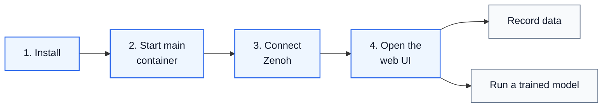

import Link from '@docusaurus/Link';
import Tabs from '@theme/Tabs';
import TabItem from '@theme/TabItem';

Cyclo Intelligence runs as a set of Docker containers with a web UI.



## Requirements

The machine that runs Cyclo Intelligence handles the web UI, the containers, recording, dataset conversion, and inference. It needs:

| Requirement | How to check |
| --- | --- |
| Docker 24 or later, with Compose | `docker compose version` |
| `git` | `git --version` |
| 35 GB free disk space | `df -h ~` |
| Port 7080 free | `ss -ltn 'sport = :7080'` — no output means free |
| NVIDIA GPU — to run trained models | `nvidia-smi` |

<details>
  <summary>More about these requirements</summary>

  **The installer only needs `git`.** It does not install Docker or the NVIDIA Container Toolkit for you.

  **A GPU is optional at this stage.** Recording data and using Data Tools work without one. A GPU is required only when you run a trained model. To confirm Docker can reach your GPU:

```bash
docker info | grep -i runtimes
```

  The `nvidia` runtime should appear in the output.

  **To use a port other than 7080,** set `CYCLO_UI_PORT` before starting the container.

  Cyclo Intelligence uses public Docker images, so you do not need a Docker Hub login.
</details>

## 1. Install

```bash
curl -fsSL https://raw.githubusercontent.com/ROBOTIS-GIT/cyclo_intelligence/main/install.sh | bash
```

This clones the `cyclo_intelligence` repository and its submodules into `~/cyclo_intelligence`. No container starts yet.

If you already have a checkout, update it instead of reinstalling:

```bash
cd ~/cyclo_intelligence
git pull
git submodule update --init --recursive
```

## 2. Start The Main Container

The main container provides the web UI, data recording, and Data Tools.

```bash
cd ~/cyclo_intelligence
./docker/container.sh start
./docker/container.sh enter
```

## 3. Connect To The Robot Network (Zenoh)

Cyclo Intelligence reaches the robot over Zenoh-based ROS 2 communication. Two things must be true:

1. A **Zenoh daemon** is running on the robot network.
2. Cyclo Intelligence knows where it is, through `ZENOH_CONFIG_OVERRIDE`.

:::important
Start the Zenoh daemon before launching Cyclo Intelligence. Follow the <Link to={props.zenohGuide}>{`${props.robotName} Zenoh Communication`}</Link> guide.
:::

Run the commands below **inside the Cyclo Intelligence container**. First check whether the variable is already set, so you do not end up with two conflicting lines:

```bash
grep ZENOH_CONFIG_OVERRIDE ~/.bashrc
```

If that prints a line, edit it with `nano ~/.bashrc` instead of appending. If it prints nothing, pick your case:

<Tabs groupId="zenoh-location">
<TabItem value="same" label="Daemon on the same machine">

```bash
echo "export ZENOH_CONFIG_OVERRIDE='transport/shared_memory/enabled=true'" >> ~/.bashrc
source ~/.bashrc
```

</TabItem>
<TabItem value="remote" label="Daemon on another machine">

Cyclo Intelligence connects as a client. Replace `192.168.0.42` with the IP address of the machine running the daemon.

```bash
echo "export ZENOH_CONFIG_OVERRIDE='transport/shared_memory/enabled=true;mode=\"client\";connect/endpoints=[\"tcp/192.168.0.42:7447\"]'" >> ~/.bashrc
source ~/.bashrc
```

</TabItem>
</Tabs>

## 4. Open The Web UI

Launch Cyclo Intelligence inside the container:

```bash
cyclo_intelligence
```

Then open the UI in a browser:

```text
http://localhost:7080/
```

If it runs on another machine, replace `localhost` with that machine's IP address, for example `http://192.168.0.42:7080/`.

{props.hostNameExample && (
  <div>
    <p>For {props.robotName}, you can also use the robot hostname when it is available on the network. For example:</p>

    <pre><code>{props.hostNameExample}</code></pre>
  </div>
)}

Setup is done — you can now record demonstrations from the `Record` page.

:::note
`cyclo_intelligence` is an alias for `ros2 launch orchestrator cyclo_intelligence_bringup.launch.py`.
:::
