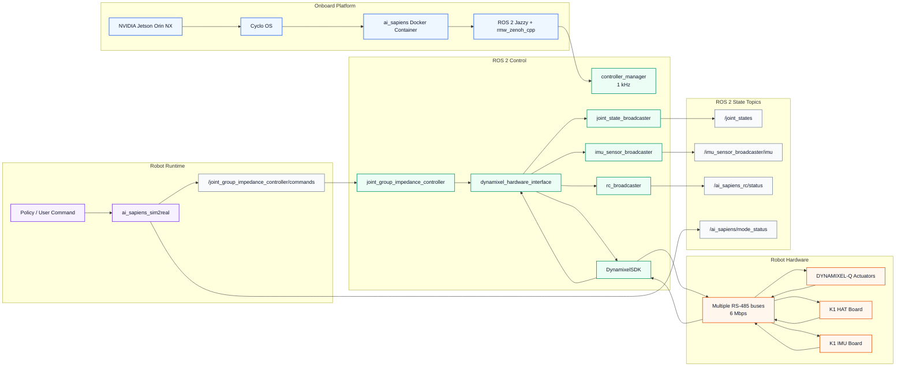
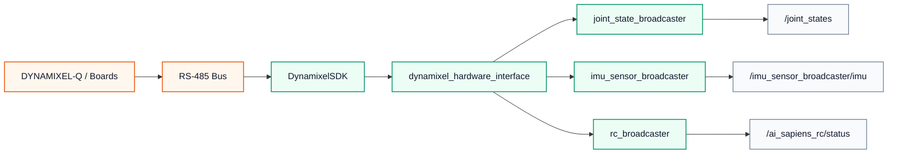

# Software Architecture

AI Sapiens K1 runs its robot software inside the `ai_sapiens` Docker container on the NVIDIA® Jetson Orin™ NX 16GB module. The base system uses Cyclo OS, a Yocto Project-based operating system, with ROS 2 Jazzy and [`rmw_zenoh_cpp`](https://github.com/ros2/rmw_zenoh) for low-latency robot communication.

The control stack is built around ROS 2 control. High-level robot commands are converted into joint commands, passed through the ROS 2 controller manager, written to DYNAMIXEL-Q actuators over multiple RS-485 buses at 6 Mbps, and reported back through ROS 2 state topics.

## Architecture Flow

## Runtime Stack

| Layer | Role |
|---|---|
| NVIDIA® Jetson Orin™ NX 16GB | Onboard compute module for robot runtime, ROS 2 nodes, and policy execution |
| Cyclo OS | Yocto Project-based robot operating system |
| `ai_sapiens` Docker container | Robot software container for the AI Sapiens ROS 2 stack |
| ROS 2 Jazzy | Robot middleware, node graph, topics, services, and ROS 2 control runtime |
| [`rmw_zenoh_cpp`](https://github.com/ros2/rmw_zenoh) | Default ROS 2 RMW layer for communication between robot-side nodes, containers, and external PCs |

External PC setup is documented separately in [ROS 2 Communication](/docs/systems/aisapiens/development_guide/ros2_communication). The sections below focus on the onboard software architecture.

## Control Flow

The command path moves from a policy or user command down to the actuator bus:

```mermaid
flowchart LR
  classDef runtime fill:#f7f0ff,stroke:#7c3aed,color:#0f172a,stroke-width:1.5px
  classDef control fill:#ecfdf5,stroke:#059669,color:#0f172a,stroke-width:1.5px
  classDef hardware fill:#fff7ed,stroke:#ea580c,color:#0f172a,stroke-width:1.5px

  Command["Policy / User Command"] --> Sim2Real["ai_sapiens_sim2real"]
  Sim2Real --> Controller["joint_group_impedance_controller"]
  Controller --> HardwareInterface["dynamixel_hardware_interface"]
  HardwareInterface --> SDK["DynamixelSDK"]
  SDK --> Bus["RS-485 Bus"]
  Bus --> Actuator["DYNAMIXEL-Q"]

  class Command,Sim2Real runtime
  class Controller,HardwareInterface,SDK control
  class Bus,Actuator hardware
```

`ai_sapiens_sim2real` produces robot joint commands from policy output, mode logic, and user command inputs. The `joint_group_impedance_controller` receives those commands and exposes them to [`dynamixel_hardware_interface`](https://github.com/ROBOTIS-GIT/dynamixel_hardware_interface) through ROS 2 control command interfaces. The hardware interface uses [DynamixelSDK](https://github.com/ROBOTIS-GIT/DynamixelSDK) to write position, feedforward torque, and impedance-control gains to the DYNAMIXEL-Q actuators.

## State Flow

The feedback path moves from the robot hardware back into ROS 2:

DYNAMIXEL-Q actuators report present position, present velocity, and present current through the hardware interface. The HAT board and IMU board are also exposed through the same ROS 2 control hardware layer, so emergency-stop state, remote-controller channels, and IMU measurements can be published as ROS 2 topics. Battery monitoring interfaces are available on the HAT board hardware layer.

## ROS 2 Control Layer

AI Sapiens K1 uses `controller_manager` at a 1 kHz update rate. The controller layer includes:

| Component | Purpose |
|---|---|
| `joint_state_broadcaster` | Publishes actuator position, velocity, and effort as `/joint_states` |
| `imu_sensor_broadcaster` | Publishes IMU orientation, angular velocity, and linear acceleration |
| `rc_broadcaster` | Publishes remote-controller input and RC link status from the HAT board state interfaces (`ai_sapiens_rc_broadcaster` plugin) |
| `joint_group_impedance_controller` | Receives joint position, feedforward, `kp`, and `kd` commands for impedance control mode (`ai_sapiens_joint_group_impedance_controller` plugin) |
| [`dynamixel_hardware_interface`](https://github.com/ROBOTIS-GIT/dynamixel_hardware_interface) | Bridges ROS 2 control command/state interfaces to DynamixelSDK |
| [`DynamixelSDK`](https://github.com/ROBOTIS-GIT/DynamixelSDK) | Handles packet communication with DYNAMIXEL-Q actuators and boards over RS-485 |

The controller command order is defined by the bringup controller configuration. For the detailed joint index map and command message definition, see [ROS 2 Package Structure](/docs/systems/aisapiens/development_guide/ros2_package_structure/).

## Main ROS 2 Interfaces

  <article className="ros-interface-card">
    

      <code>/joint_states</code>
      Hardware to ROS 2
    

    

      Type
      <code>sensor_msgs/msg/JointState</code>
    

    
Joint position, velocity, and effort feedback.

  </article>

  <article className="ros-interface-card">
    

      <code>/imu_sensor_broadcaster/imu</code>
      Hardware to ROS 2
    

    

      Type
      <code>sensor_msgs/msg/Imu</code>
    

    
Pelvis IMU orientation, angular velocity, and linear acceleration.

  </article>

  <article className="ros-interface-card">
    

      <code>/joint_group_impedance_controller/commands</code>
      ROS 2 to controller
    

    

      Type
      <code>ai_sapiens_interfaces/msg/JointImpedanceCommand</code>
    

    
Joint position, feedforward torque, and impedance-control gain command.

  </article>

  <article className="ros-interface-card">
    

      <code>/ai_sapiens_rc/input</code>
      RC broadcaster to ROS 2
    

    

      Type
      <code>sensor_msgs/msg/Joy</code>
    

    
Normalized remote-controller axes and buttons.

  </article>

  <article className="ros-interface-card">
    

      <code>/ai_sapiens_rc/status</code>
      RC broadcaster to ROS 2
    

    

      Type
      <code>ai_sapiens_interfaces/msg/RcStatus</code>
    

    
RC link, failsafe, and HAT-board status.

  </article>

  <article className="ros-interface-card">
    

      <code>/cmd_vel</code>
      User/API to runtime
    

    

      Type
      <code>geometry_msgs/msg/Twist</code>
    

    
Velocity command input for API-controlled behavior.

  </article>

  <article className="ros-interface-card">
    

      <code>/ai_sapiens/api_heartbeat</code>
      User/API to runtime
    

    

      Type
      <code>ai_sapiens_interfaces/msg/ApiHeartbeat</code>
    

    
Advancing-sequence heartbeat required while API authority is active.

  </article>

  <article className="ros-interface-card">
    

      <code>/ai_sapiens/set_mode_by_name</code>
      User/API to runtime
    

    

      Type
      <code>ai_sapiens_interfaces/srv/SetModeByName</code>
    

    
Requests a named robot control mode.

  </article>

  <article className="ros-interface-card">
    

      <code>/ai_sapiens/list_modes</code>
      User/API to runtime
    

    

      Type
      <code>ai_sapiens_interfaces/srv/ListModes</code>
    

    
Lists available robot control modes.

  </article>

  <article className="ros-interface-card">
    

      <code>/ai_sapiens/mode_status</code>
      Runtime to ROS 2
    

    

      Type
      <code>ai_sapiens_interfaces/msg/ModeStatus</code>
    

    
Current mode and command authority status.

  </article>

